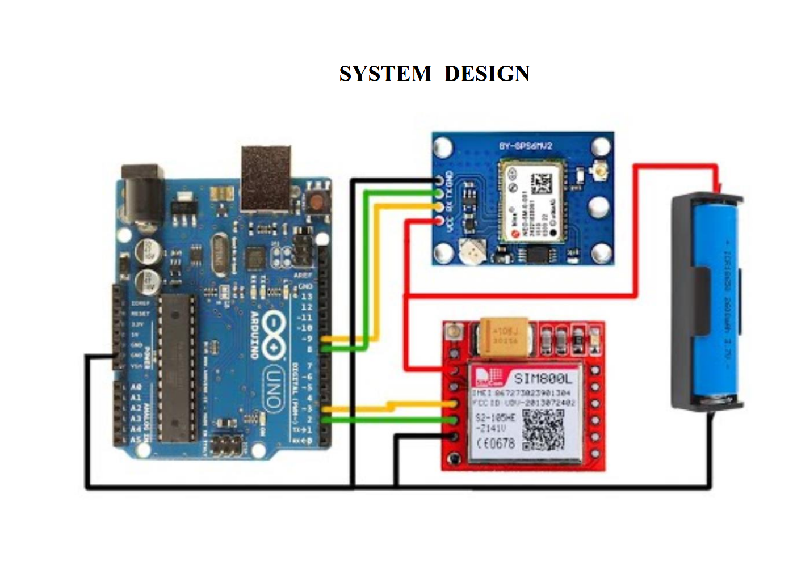
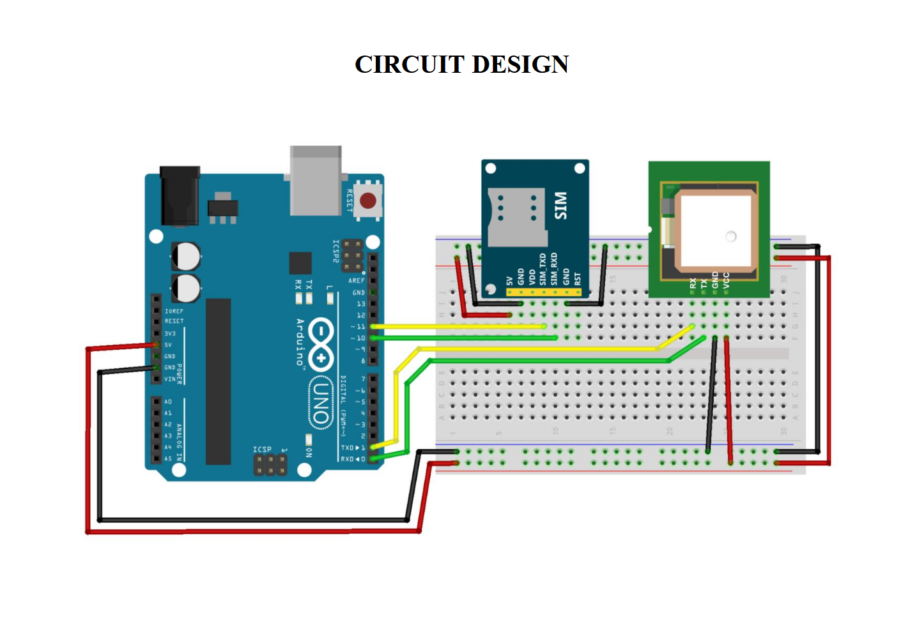
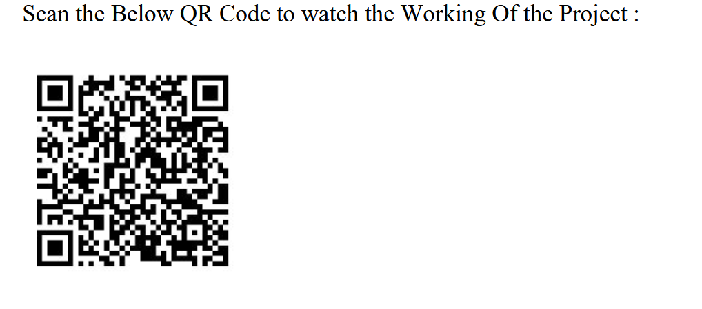

# Arduino GPS Tracker with SIM800L

A simple GPS tracker using Arduino UNO, SIM800L GSM module, and Neo-6M GPS. Sends a Google Maps location link via SMS every 10 minutes.

No WhatsApp, no server, no Twilio—just plain GSM SMS.

## Components

| S.No | Component                  | Value/Model | Qty |
|------|----------------------------|-------------|-----|
| 1    | Arduino UNO                | -           | 1   |
| 2    | USB Cable Type A to B      | -           | 1   |
| 3    | GPS Module                 | NEO-6M      | 1   |
| 4    | GSM Module                 | SIM800L     | 1   |
| 5    | Power Adapter for Arduino  | 9V          | 1   |
| 6    | Li-ion Battery for SIM800L | 3.7V        | 1   |
| 7    | Jumper Wires               | -           | 1   |

## System Design



The system consists of an Arduino UNO connected to a NEO-6M GPS module for location data and a SIM800L GSM module for sending SMS. The SIM800L is powered by an external Li-ion battery to meet its 2A peak current requirement.

## Circuit Design



## Required Libraries

Install from Arduino Library Manager:
- **TinyGPS++**

## Pin Connections

### GPS (Neo-6M to Arduino)
| GPS | Arduino |
|-----|---------|
| TX  | D4      |
| RX  | D3      |
| VCC | 5V      |
| GND | GND     |

### SIM800L to Arduino
| SIM800L | Arduino            |
|---------|--------------------|
| TX      | D7                 |
| RX      | D8                 |
| GND     | GND                |
| VCC     | External 4V supply |

**Important:** Do not power the SIM800L from the Arduino 5V pin. It needs 4.0–4.2V with 2A peak current capability. Use a buck converter or Li-ion battery.

## SMS Output Example

```
Live Location:
https://maps.google.com/?q=15.391234,73.877654
```

Clicking the link opens the location directly in Google Maps.

## Important Notes

1. **SIM800L Power:** Must receive sufficient current (2A peak). Use a buck converter or Li-ion battery.
2. **GPS Fix:** The first fix can take 1–2 minutes outdoors with a clear sky view.
3. **Phone Format:** Use international format (e.g., +91XXXXXXXXXX).
4. **SIM Card:** Ensure the SIM has SMS capability and sufficient balance.

## Getting Started

1. Install the TinyGPS++ library from Arduino Library Manager
2. Connect the hardware according to the pin connections above
3. Open `gps_tracker.ino` in Arduino IDE
4. Replace `+91XXXXXXXXXX` with your phone number
5. Upload to Arduino UNO
6. Wait for GPS fix (the LED on the GPS module may blink)
7. Receive an SMS every 10 minutes with your location

## Possible Upgrades

- Send SMS only when location changes
- Add low power sleep mode
- Send location on missed call
- Add geo-fencing alerts
- Store last location in EEPROM
- Battery voltage monitoring

## Contributing

Pull requests are welcome. For major changes, please open an issue first.

## Appendix

Scan the QR code below to watch the working demo of the project:


